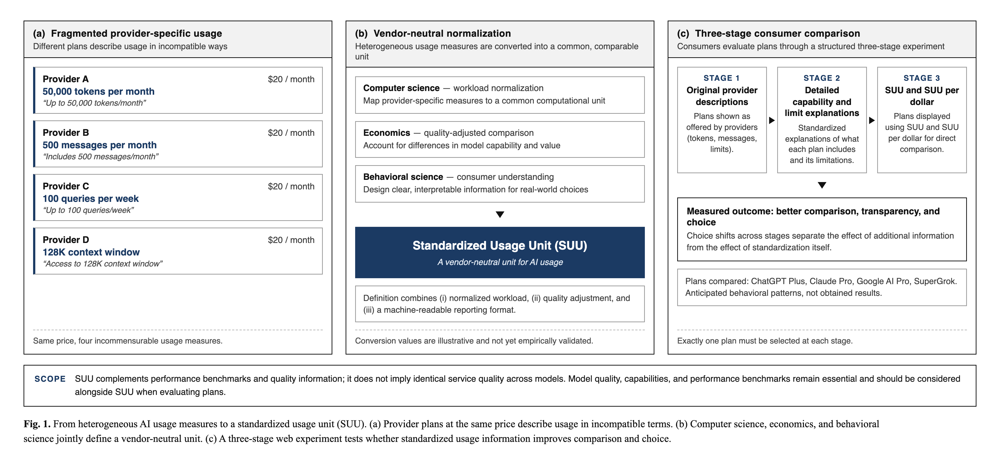

# Toward a Standardized Unit of AI Usage

[](https://huggingface.co/spaces/dku-comsci-econ206-2026/gihun-space)
[](https://colab.research.google.com/drive/1EgajrDNORTv1QM_G9HKN74O0B_UlOC7E?usp=sharing)

**Making Heterogeneous LLM and Agent Services Comparable**

An interdisciplinary research prototype for comparing AI subscription services whose usage limits are expressed in incompatible forms such as tokens, messages, rolling windows, weekly pools, and feature-specific restrictions.

The project proposes a **Standardized Usage Unit (SUU)** framework that combines workload-specific benchmark quality with comparable service-capacity measurement while explicitly preserving differences across reasoning, coding, and agentic workloads.



## Research question

AI subscription plans increasingly offer heterogeneous models, agents, and tools, but the amount of usable service is difficult to compare across providers.

This project asks three connected questions:

- **Economics:** How does standardized, quality-aware usage information change the comparison and perceived value of competing AI subscription plans?
- **Computer science:** How can heterogeneous provider limits and model capabilities be converted reproducibly into comparable reasoning, coding, and agentic usage units?
- **Behavioral science:** Does standardization improve consumer understanding and plan selection, or can a common numerical measure itself create anchoring and false comparability?

The broader question is whether a technically standardized measure can also be **economically meaningful and behaviorally useful**.

## SUU framework

For provider $p$ and workload $j \in \{R,C,A\}$, the full framework defines

$$\mathrm{SUU}_{p,j}=C_{p,j}B_{p,j}.$$

Here:

- $B_{p,j}$ is workload-specific benchmark quality.
- $C_{p,j}$ is the number of standardized reference tasks supported by the provider's binding usage constraint.

Benchmark quality is computed as

$$B_{p,j}=\frac{1}{|K_j|}\sum_{k\in K_j}\frac{S_{p,k}}{\max_q S_{q,k}}.$$

The benchmark groups are:

- **Reasoning:** HLE, GDP.pdf, CritPt, Omniscience, LCR
- **Coding:** Terminal-Bench, SciCode
- **Agentic:** AA-Briefcase, GDPval-AA, AutomationBench

The Overall benchmark-quality score is the equal-weight average

$$B_p=\frac{B_{p,R}+B_{p,C}+B_{p,A}}{3}.$$

### Current PS1 capacity proxy

The current data do not provide total tokens consumed by a standardized task. Therefore, this project does **not** claim to have measured the final workload-specific capacity $C_{p,j}$.

Let:

- $Q_p$: estimated monthly usable-token allowance
- $O_p$: Artificial Analysis output tokens per weighted task
- $T_p$: unobserved total tokens consumed by that task

Because

$$T_p\ge O_p,$$

the actual task capacity satisfies

$$C_p=\frac{Q_p}{T_p}\le\frac{Q_p}{O_p}\equiv C_p^{\mathrm{out}}.$$

The notebook therefore reports

$$\mathrm{SUU}^{\mathrm{out}}_p=C_p^{\mathrm{out}}B_p$$

and

$$\mathrm{SUUPerDollar}_p=\frac{\mathrm{SUU}^{\mathrm{out}}_p}{P_p}$$

only as **upper-bound proxies**, not as observed monthly task counts or final workload-specific SUUs.

## Computational results

The final computational snapshot compares four subscription plans and their associated model configurations.

| Plan | Overall | Reasoning | Coding | Agentic |
|---|---:|---:|---:|---:|
| ChatGPT Plus | 99.20 | 99.76 | 99.12 | 98.72 |
| Claude Pro | 66.03 | 61.36 | 59.23 | 77.51 |
| Google AI Pro | 75.89 | 75.96 | 66.95 | 84.76 |
| SuperGrok | 78.84 | 70.69 | 66.92 | 98.91 |

The corresponding plan-level capacity and SUU upper-bound proxies are:

| Plan | Output-capacity upper bound | SUU upper-bound proxy | SUU/$ upper-bound proxy |
|---|---:|---:|---:|
| ChatGPT Plus | 5,888.89 | 5,841.79 | 292.09 |
| Claude Pro | 33,644.07 | 22,216.46 | 1,110.82 |
| Google AI Pro | 31,267.61 | 23,729.62 | 1,187.07 |
| SuperGrok | 14,138.89 | 11,147.41 | 371.58 |

These values should be interpreted cautiously.

They are **output-token-based capacity upper bounds**, not observed monthly task capacities.

A $\pm 20\%$ sensitivity analysis on each monthly quota estimate produces the same proportional change in $C_p^{\mathrm{out}}$, $\mathrm{SUU}^{\mathrm{out}}_p$, and SUU-per-dollar.

## Try the project

### Hugging Face interactive prototype

**[Open the AI Subscription Comparison Prototype](https://huggingface.co/spaces/dku-comsci-econ206-2026/gihun-space)**

The browser-based prototype presents the same four subscription plans through three information stages:

1. **Provider information** — original provider-facing descriptions
2. **Detailed information** — clearer explanations of capabilities and usage constraints
3. **Standardized comparison** — workload-specific benchmark-quality views plus plan-level capacity and SUU upper-bound proxies

Stage 3 presents:

- Overall benchmark quality
- Reasoning benchmark quality
- Coding benchmark quality
- Agentic benchmark quality
- $C_p^{\mathrm{out}}$
- $\mathrm{SUU}^{\mathrm{out}}_p$
- SUU-per-dollar upper-bound proxy

The prototype is designed to illustrate the project's behavioral question: whether standardized information improves comparison or instead encourages numerical anchoring.

It does not yet establish a causal behavioral or welfare effect.

### Google Colab notebook

**[Open the computational notebook in Google Colab](https://colab.research.google.com/drive/1EgajrDNORTv1QM_G9HKN74O0B_UlOC7E?usp=sharing)**

The notebook implements the computational component of the project.

1. loads the selected Artificial Analysis benchmark data;
2. groups benchmarks into Reasoning, Coding, and Agentic workloads;
3. normalizes each benchmark relative to the strongest compared configuration;
4. computes $B_{p,R}$, $B_{p,C}$, and $B_{p,A}$;
5. computes the equal-weight Overall score $B_p$;
6. loads external monthly allowance estimates $Q_p$;
7. uses Artificial Analysis output tokens per weighted task $O_p$;
8. computes the output-capacity upper bound $C_p^{\mathrm{out}}$;
9. computes the quality-adjusted $\mathrm{SUU}^{\mathrm{out}}_p$ proxy;
10. computes SUU-per-dollar;
11. runs a $\pm 20\%$ quota sensitivity analysis;
12. produces the reported tables and outputs.

To reproduce the analysis, open the notebook and select:

```text
Runtime → Run all
```

The notebook uses:

- `pandas`
- `numpy`
- `matplotlib`

These packages are normally preinstalled in Google Colab.

## Repository structure

```text
.
├── appendices/
├── colab_code/
│   ├── README.md
│   └── W3_Gihun_Lee.ipynb
├── figures/
│   ├── ps1_teaser.drawio
│   ├── ps1_teaser.pdf
│   ├── ps1_teaser.png
│   ├── ps1_teaser.svg
│   ├── tencent_fieldtrip.JPG
│   └── museum_fieldtrip.JPG
├── hf_code/
│   ├── README.md
│   ├── index.html
│   ├── app.js
│   ├── data.js
│   └── style.css
├── instructions/
├── sections/
├── main.tex
├── references.bib
├── preview.pdf
└── README.md
```

## Run locally

### Computational notebook

Python 3 is required.

```bash
python3 -m pip install jupyter pandas numpy matplotlib
python3 -m jupyter notebook colab_code/W3_Gihun_Lee.ipynb
```

### Interactive prototype

The Hugging Face artifact is a static client-side application.

You can serve the files under `hf_code/` locally with:

```bash
python3 -m http.server 8000 --directory hf_code
```

Then open:

```text
http://localhost:8000
```

## Interpretation and limitations

- The workload-specific benchmark scores measure **relative model quality among the four compared configurations**, not absolute quality.
- Each benchmark is normalized relative to the best-performing model among the four included plans, so the scores depend on the comparison set.
- Monthly usable-token allowances are external estimates rather than uniform provider-published subscription budgets.
- The Google AI Pro allowance is treated as a **low-confidence estimate** in the current computation.
- $C_p^{\mathrm{out}}=Q_p/O_p$ is only an **upper bound** because total task consumption also includes input and potentially cached-input tokens.
- The current project does not yet measure workload-specific $C_{p,j}$.
- The current $\mathrm{SUU}^{\mathrm{out}}_p$ proxy uses the Overall benchmark-quality score $B_p$ with a plan-level capacity upper bound.
- Provider models, rate limits, quotas, and subscription rules may change over time.
- The Hugging Face prototype demonstrates an information-design concept but does not establish that SUU improves consumer decisions.
- Behavioral and welfare effects require controlled user evaluation.

## Behavioral evaluation

The proposed behavioral experiment separates additional information from standardization.

### Stage 1

Participants see original provider-facing plan information.

### Stage 2

Participants receive clearer explanations of capabilities and usage constraints.

### Stage 3

Participants receive standardized benchmark-quality information and plan-level capacity/SUU upper-bound proxies.

A later controlled study compares:

- an **Overall-only** standardized interface; and
- a **four-view** interface showing Overall, Reasoning, Coding, and Agentic information.

The primary outcome is **workload-choice consistency**: whether a participant selects a plan that matches the assigned workload profile.

Secondary outcomes include:

- usage-comprehension accuracy;
- choice confidence;
- final plan choice;
- frequency of choosing the numerically largest Overall SUU regardless of workload fit.

This design tests whether standardization improves interpretation or instead creates numeric anchoring.

## Economic interpretation

The economic motivation is not simply to produce a larger number for each provider.

A useful standardized measure should preserve economically relevant differences across:

- workload type;
- model quality;
- error sensitivity;
- provider constraints;
- price.

The project therefore treats a single Overall SUU as a convenience rather than a sufficient representation of value.

A future economic validation compares two AI services across two workloads while varying the cost of model errors.

If an aggregate standardized measure repeatedly changes the service preferred under task-specific quality and error sensitivity, the aggregate measure should not be treated as sufficient.
